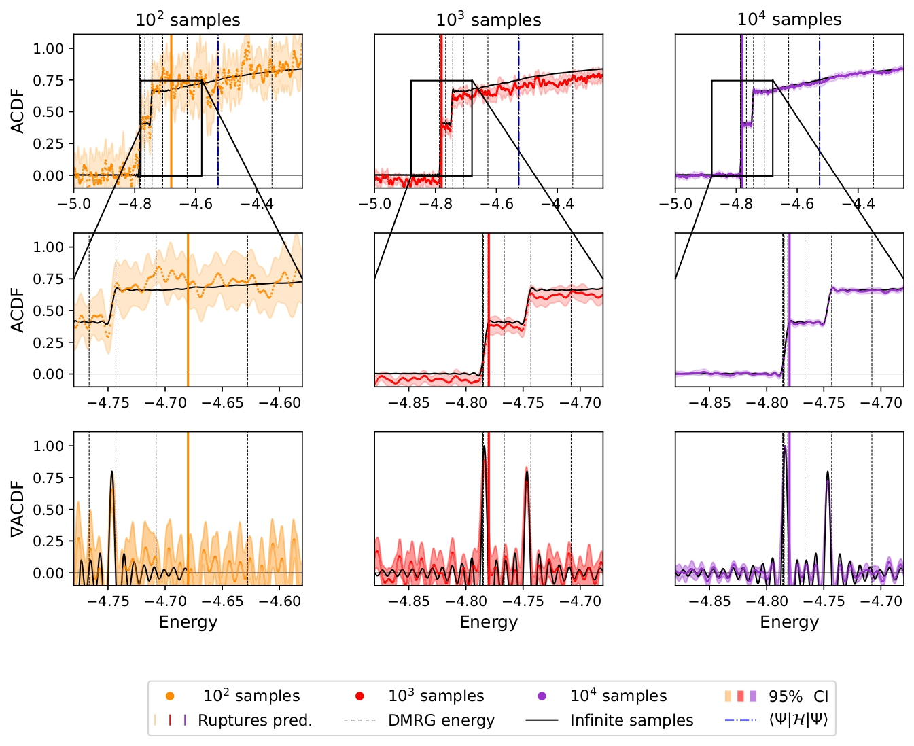
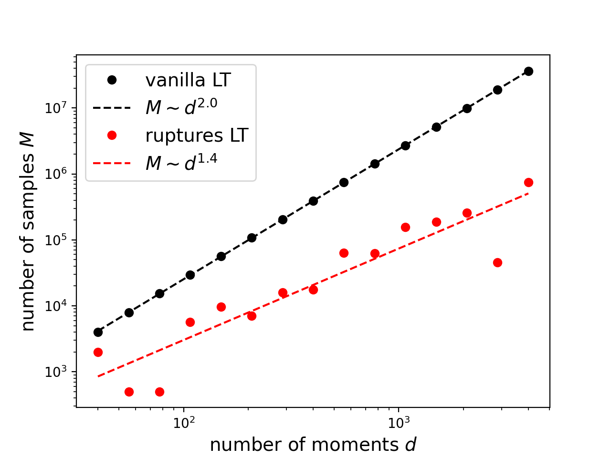

# Early fault-tolerant quantum algorithms in practice
 
This is the code for the paper [arXiv:2405.03754](https://arxiv.org/abs/2405.03754). 

# Initial state

The first step is to compute the initial state. This can be done with DMRG in the file dmrg.py using `tenpy`. Otherwise, a random initial state will be provided. 

# Dynamics

The second part of the algorithm is to compute the Fourier moments of the target Hamiltonian $\langle \psi| e^{-iH\tau j}|\psi\rangle$. This can be done with the dyncamic.py script, which relies on [qsimcirq](https://quantumai.google/qsim/tutorials/qsimcirq). In this script we consider the fully connected Heisenberg model and the evolution is performed with Trotterization via a swap network. 

# Lin and Tong algorithm

The bulk of the algorithm can be run using the main.py file which computes the Fourier decomposition (in the algorithms/Fk.py script), samples from the Fourier moments, and builds the estimator. The CDF for 26 spins fully connected Hamiltonian using low-bond dimension initial is displayed below. 

# Step detection

The steps are automatically detected within the main script through the algorithms/trendfliter.py file.  The step detection is better illustrated in the notebook `resources_comparison.ipynb`, which estimates the number of samples required to detect a step of a given size. 

# How to cite 

If you use this work for your research, please cite us! 

> @misc{EFTQC_practice,
title = "Early Fault-Tolerant Quantum Algorithms in Practice: Application to Ground-State Energy Estimation",
author = {Oriel Kiss and Utkarsh Azad and Borja Requena and Alessandro Roggero and David Wakeham and Juan Miguel Arrazola },
     year={2024},
month = {5},
      eprint={2405.03754},
      archivePrefix={arXiv},
      primaryClass={quant-ph}
}
